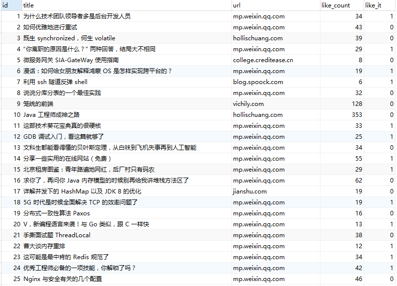

## toutiao.io 个人收藏文章爬虫

<p>
<a href="#"></a>
<a href="#"></a>
<a href="#"></a>
<a href="#"></a>
<a href="#"></a>
<a href="#"></a>
</p>

### 背景
> 收藏文章是每个技术人的常规操作，主要的原因是平时我们没有太多时间去进行阅读，于是总是想着先收藏起来等到有空的时候我们再去翻一下收藏的文章。
但是我们忙的时间总比闲的时间多，收藏的文章也数不过来，很多以前收藏的好文章还没阅读就已经被新的收藏给埋到地底了，写这个小东西主要是想有空的时候跑一下看看还有哪些未读的文章，
以及能够按照不同的维度进行排序来安排阅读计划，还可以统计一下个人收藏文章的一些关键词。

### 软件要求
 - mysql 5.7
 - python 3.6+
 - Anaconda(可选)
 
### 安装依赖
```
pip install -r requirement
```
 
### 目录结构
 - app
   - model
   - util
 - main.py
 - config.py
 - config.example.json

### 配置说明
 - 需要修改 `config.py` 中的 `header` 为登陆后的请求头才能够请求到对应的收藏页面
 - 默认使用`config.example.json`作为配置文件使用，需要编辑对应的数据库信息后才可使用

### 使用说明
 ```
 python main.py
 ```
 
### 数据库说明
 - 需要先创建数据库，执行时会自动创建数据表
 - 也可以手动建表，具体可见`tt_crawler.sql`文件

### 截图

